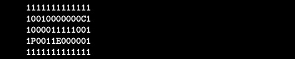

# So_Long
 

>This project is a very small 2D game. Its purpose is to make you work with textures, sprites, and some other very basic gameplay elements.
 

## ✅ Mandatory part

Your project must comply with the following rules:

- You must use the MiniLibX. Either the version available on the school machines, or installing it using its sources.
- Your program has to take as parameter a map description file ending with the `.ber` extension.
- Game:
	- The player’s goal is to collect every collectible present on the map, then escape chosing the shortest possible route.
	- The W, A, S, and D keys must be used to move the main character.
	- The player should be able to move in these 4 directions: up, down, left, right.
	- The player should not be able to move into walls.
	- At every move, the current number of movements must be displayed in the shell.
	- You have to use a 2D view (top-down or profile).
	- The game doesn’t have to be real time.
	- Although the given examples show a dolphin theme, you can create the world you want.
- Graphic management:
	- Your program has to display the image in a window.
	- The management of your window must remain smooth (changing to another window, minimizing, and so forth).
	- Pressing ESC must close the window and quit the program in a clean way.
	- Clicking on the cross on the window’s frame must close the window and quit the program in a clean way.
	- The use of the images of the MiniLibX is mandatory.
- Map:
	- The map has to be constructed with 3 components: walls, collectibles, and free space.
	- The map can be composed of only these 5 characters:
		- 0 for an empty space,
		- 1 for a wall,
		- C for a collectible,
		- E for a map exit,
		- P for the player’s starting position
	- Here is a simple valid map:
	
	
	 
	
	- The map must contain 1 exit, at least 1 collectible, and 1 starting position to be valid.
	- If the map contains a duplicates characters (exit/start), you should display an error message.
	- The map must be rectangular.
	- The map must be closed/surrounded by walls. If it’s not, the program must return an error.
	- You have to check if there’s a valid path in the map.
	- You must be able to parse any kind of map, as long as it respects the above rules.
	- Another example of a minimal `.ber` map:
	
	
	 

	- If any misconfiguration of any kind is encountered in the file, the program must exit in a clean way, and return "Error\n" followed by an explicit error message of your choice.

 

## ⭐ Bonus

You will get extra points if you:

- Make the player lose when they touch an enemy patrol.
- Add some sprite animation.
- Display the movement count directly on screen instead of writing it in the shell.

For this project, I did not implement the bonus feature.
